# CyCalendar

CyCalendar est un outil qui synchronise automatiquement ou manuellement votre emploi du temps CY Tech avec Google Calendar. Le choix de google calendar a été fait puisque ce service est connecté avec d'autres applications comme le calendrier d'apple ou encore notion.

Si jamais vous rencontrez une erreur vérifiez sur votre repository si le miens a une nouvelle mise à jour (vérifiez le contenu du push cela pourrait être une execution de update calendar). Si aucune mise à jour n'est disponible et que votre problème persiste n'hésitez pas à me contacter (contacts en pied de page).

## Fonctionnalités

- Authentification automatique avec le système CY Tech
- Récupération de votre emploi du temps
- Conversion au format ICS
- Synchronisation avec Google Calendar
- Coloration automatique : bleu pour les CM, rouge doux pour les TD (Possibilité de modifier les couleurs à voir plus bas)
- Compatible avec Windows et Linux

## Installation et Utilisation

   Ce script peut être utilisé de 3 façons: Génération simple du .ics et import manuel par vos soins ou bien import automatique via l'api de google avec possibilité d'ajout des mises à jour automatiques via github actions.

   Des erreurs sont susceptibles d'arriver et pourtant de ne pas gêner l'execution du programme. Vérifiez par vous même le fonctionnement ou non du programme.

### Prérequis

- **Windows** : Python 3.8+ et Chrome ou Microsoft Edge
- **Linux** : Python 3.8+ et Chrome/Chromium

### Généralités

**Si vous comptez aller jusqu'à l'étape 3 (automatisation + mises à jours automatiques), alors ne clonez pas le repo mais forkez le plutôt. Cela vous permettra d'avoir une copie de mon repo dans vos repo, vous en aurez besoin pour l'ajout du scheduler.**

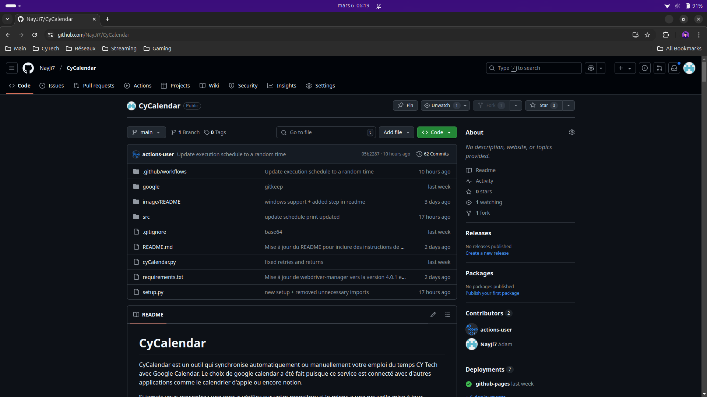
(Bouton fork juste au dessus du bouton code en vert à droite)

### Installation automatique

En suivant les étapes du setup.py que j'ai créé vous pouvez mettre en place l'installation de ce service de manière plus ou moins automatique. Certaines actions seront à faire par vos soins, j'ai automatisé ça du mieux que j'ai pu. (Le setup.py vous laisse choisir le mode désiré, vous pouvez faire une installation du mode manuel avec). Les étapes du setup.py et de l'installation diffèrent sur certains points puisque j'automatise certain aspects (pas besoin de vous embêter avec les explications dans ce cas).			

### Installation manuelle

Cette catégorie n'est pas utile si vous avez choisi l'utilisation du setup.py puisque celui ci vous guide déjà dans la configuration du service. Elle peut servir à vérifier que votre installation s'est faite correctement à la limite mais normalement vous n'en aurez pas besoin si vous êtes passés par le setup.py.

#### 1. Mode manuel

   Cette utilisation est de loin la plus simple. Voici ses étapes :

##### Pour Linux :

1. Installer les dépendances ubuntu et python en éxecutant la commande suivante : ``./setup.bash # à la racine du projet``

##### Pour Windows :

1. Installer les dépendances python en exécutant le script ``setup.bat`` (double-cliquez dessus ou exécutez-le en ligne de commande)

##### Pour tous les systèmes :

2. Créer un fichier nommé '.env' à la racine du projet contenant ces informations :

   ```
   CY_USERNAME=username # e-1erelettreprenom+nom
   CY_PASSWORD=password # votre mot de passe
   ```
3. Executez le script en lançant la commande : ``python cyCalendar.py`` (ou ``python3 cyCalendar.py`` sous Linux)

   Quelques erreurs devraient survenir mais le principal réside dans la génération du .ics. Si à l'étape 2 vous obtenez un message de ce style :

   ```
   Fichier ICS créé avec succès: /home/cytech/Desktop/CyCalendar/generated/cy_calendar.ics (257 événements)
   ```

   Alors c'est gagné. Votre fichier .ics se trouve dans le dossier generated/ et vous n'avez plus qu'à aller sur google agenda, selectionner le + pour créer un nouvel agenda.

   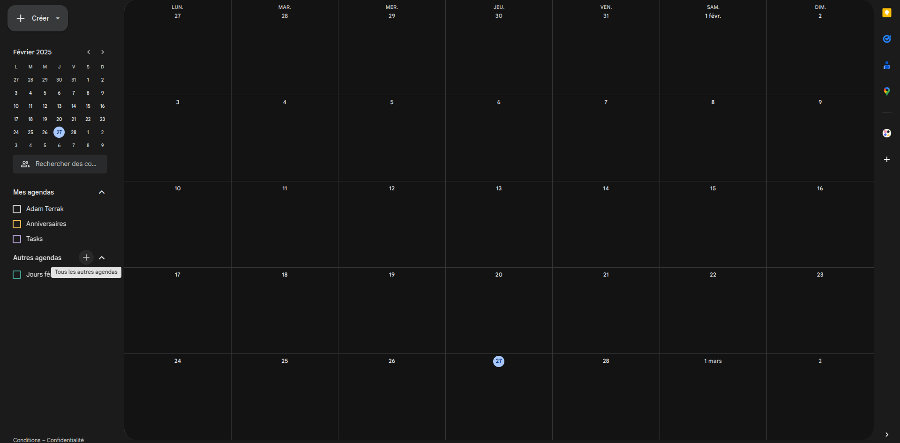

   Appelez le comme vous le souhaitez (Cours CY par exemple), puis créez le.
   Ensuite Il ne vous restera plus qu'à cliquer sur importer et exporter, choisir votre nouveau calendrier et selectionner le .ics précedemment généré.

   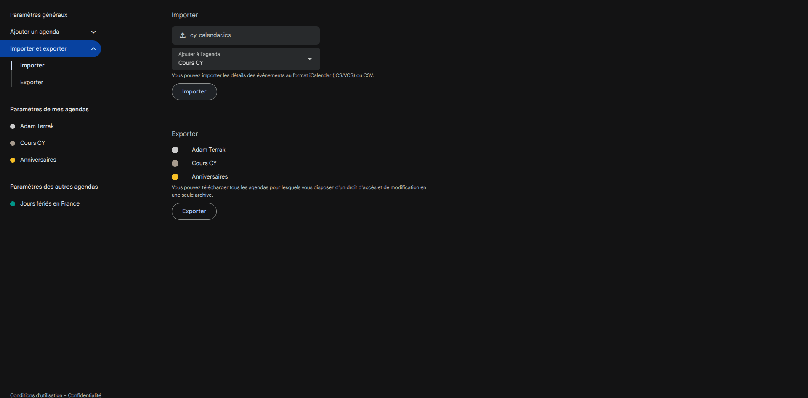

   Après cela, google agenda va mouliner et retourner un message de validation confirmant le nombre d'éléments importés.

   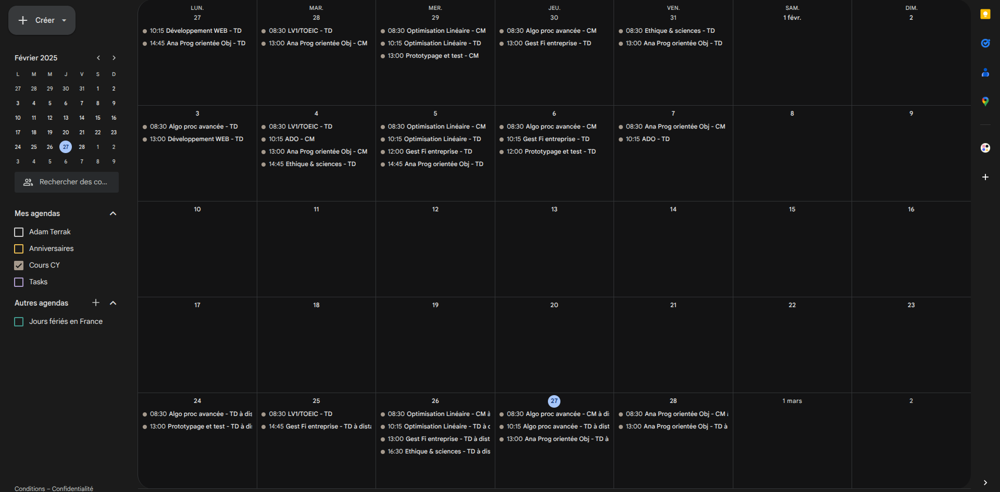

   Une fois le chargement fini vous remarquez qu'en revenant en arrière vous avez bien votre nouvel agenda avec vos cours.

   **CETTE METHODE N'ACTUALISE RIEN.** Ce qui signifie qu'il faudra recommencer à chaque fois que vous voudrez récupérer votre emploi du temps pour cette année. Embettant n'est ce pas ? C'est pourquoi la 2e méthode est bien plus efficace.

#### 2. Mode automatique (Sans Github Actions)

   Passons maintenant à la méthode la plus intéressante mais également la plus complexe. Nous allons configurer le script pour importer automatiquement le .ics dans google agenda en passant via l'api.

   Pour cette methode plus d'étapes et de prérequis sont nécessaires. Alors accrochez vous bien, ça vaut quand même le coup.

1. Réaliser les étapes d'installation et de configuration du fichier .env correspondant à votre système d'exploitation (voir section "Utilisation manuelle")
2. Se rendre sur https://console.cloud.google.com/?hl=fr et vous connecter avec l'adresse mail de votre choix. Une fois sur cette page vous allez cliquer sur Sélectionnez un projet puis Nouveau projet.

   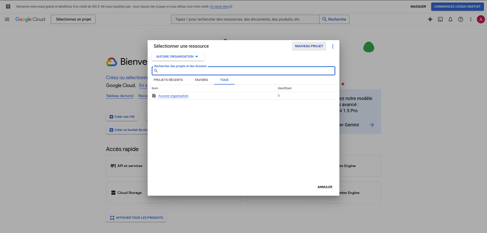

   Renommez le ou laissez tout tel quel qu'importe, puis cliquez sur créer. Patientez le temps que la création se finisse puis ouvrez le en cliquant sur le popup à droite.
   Une fois sur le tableau de bord, recherchez 'google calendar api' dans la barre de recherche et cliquez sur le 1er résultat.

   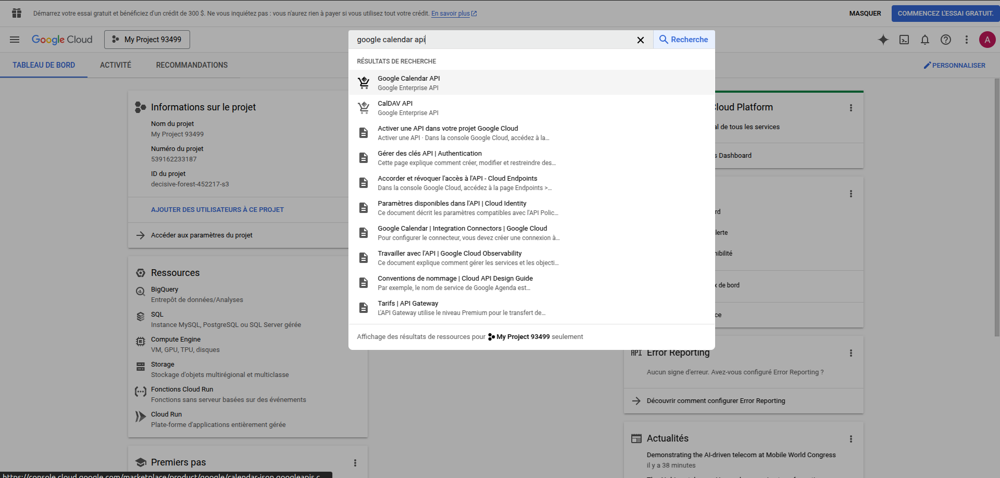

   Cliquez sur Activer et patientez.

   Cliquez ensuite sur Ecran de consentement OAuth dans le menu à gauche.

   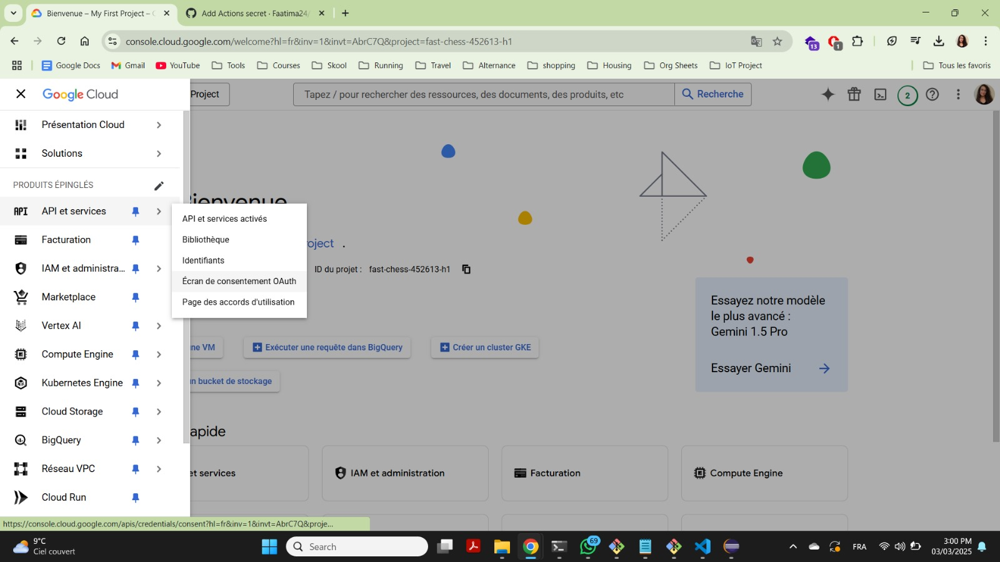

   Ensuite dans la catégorie Audience allez dans utilisateurs tests puis cliquez sur add users

   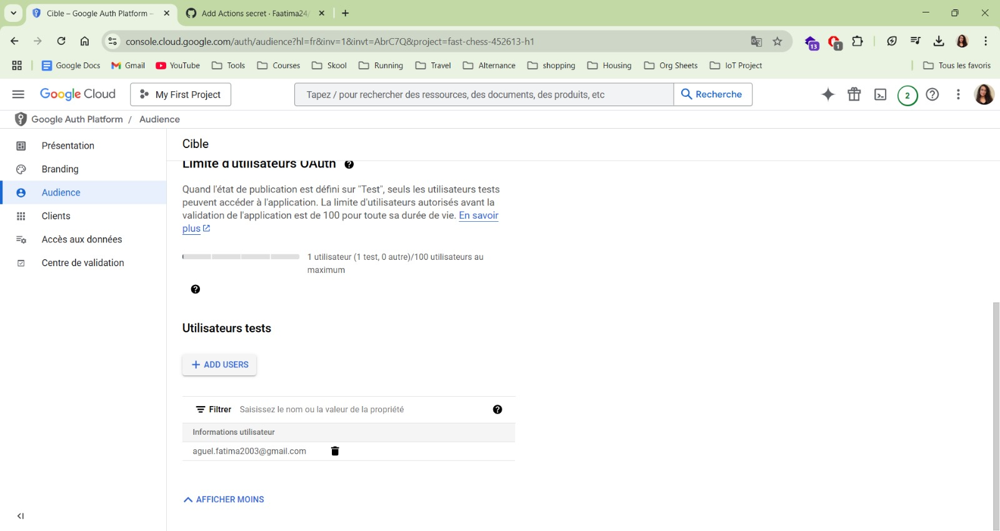

   Ajoutez votre adresse mail, enregistrez là puis retourner sur l'écran d'authentification google.

   Après cela rendez vous dans le menu à gauche catégorie identifiants puis cliquez sur créer des identifiants.

   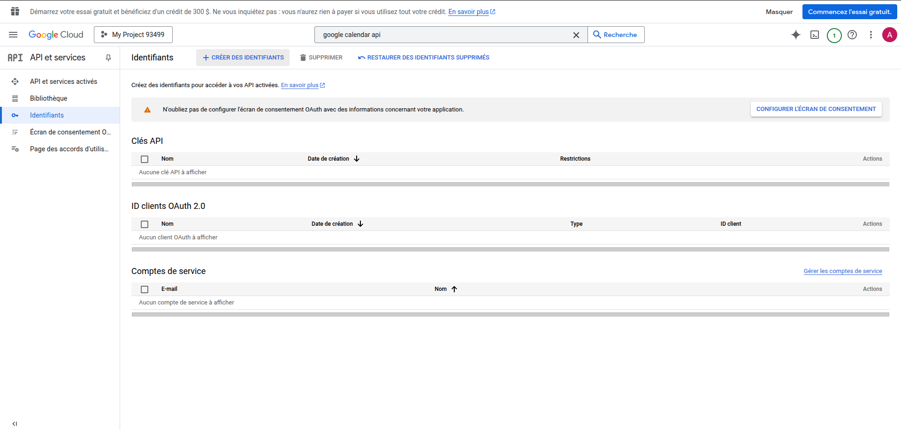

   Choisissez ID client OAuth. Cliquez sur Configurer l'écran de consentement, premiers pas puis mettez le nom et l'adresse que vous souhaitez.

   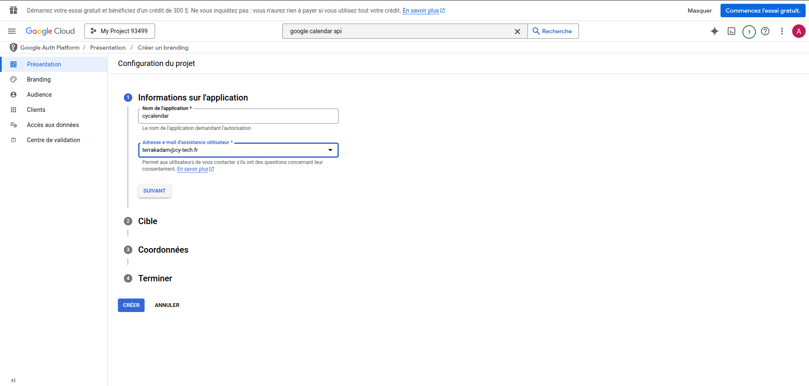

   Choisissez externe, suivant, votre adresse mail encore, suivant, cochez la case, continuer puis créer.
   Par la suite séléctionnez Clients sur la gauche puis create client.

   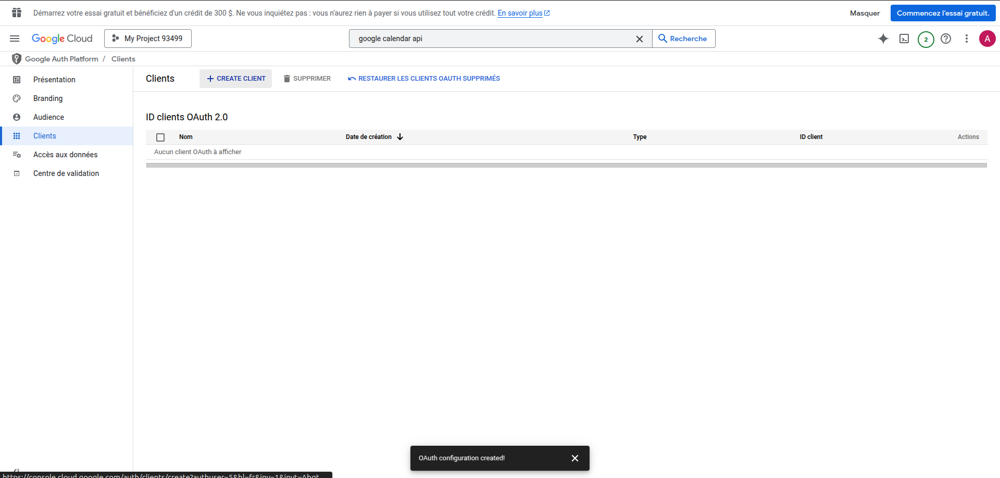

   Choisissez application de bureau, et modifiez le nom si vous le souhaitez (aucune importance). Cliquez ensuite sur créer.
   Ensuite cliquez sur le client que vous avez créé puis sous Codes secrets du client cliquez sur l'icone de téléchargement sous format json.

   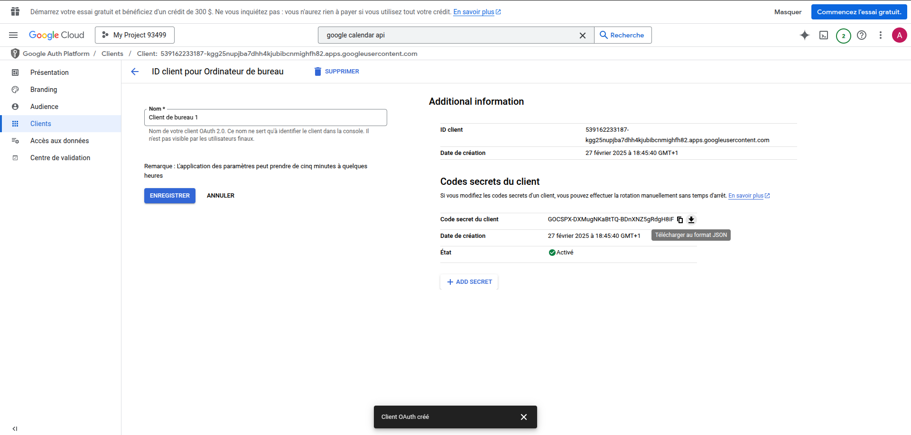

   Il ne vous reste plus qu'à déplacer ce fichier .json tel quel dans le dossier google et c'est fini pour cette étape !
3. Pour finir, executez le script en lançant la commande : ``python cyCalendar.py`` (ou ``python3 cyCalendar.py`` sous Linux). Cette fois ci à l'étape 3 une fenetre d'authentification google s'ouvrira, selectionnez la même adresse que celle utilisée précedemment.

   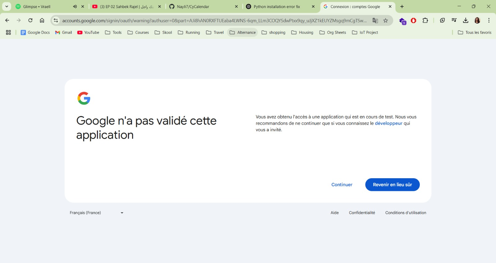

   Cliquez sur continuer.

   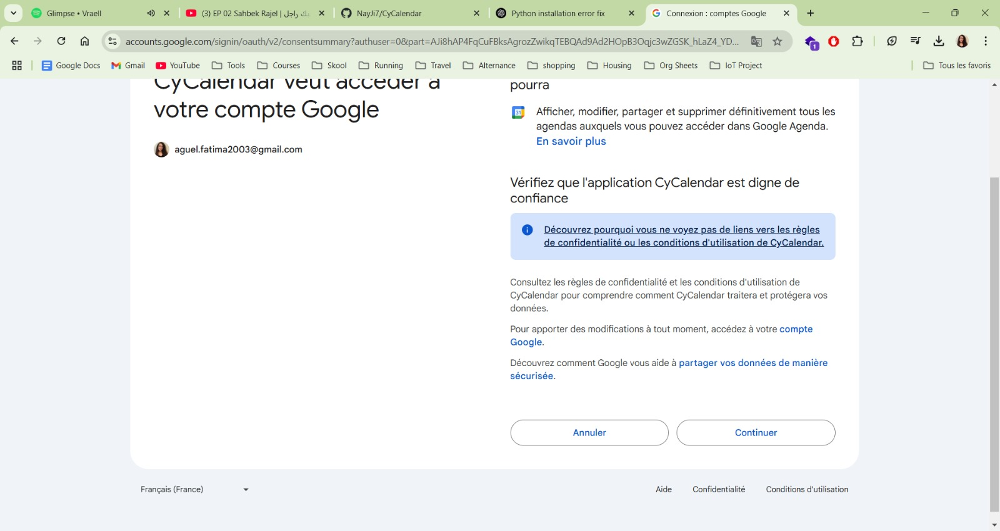

   Cliquez encore sur continuer, et voilà. Après un peu d'attente, le programme devrait avoir réussi à récupérer les données de votre calendrier et à les importer dans votre agenda.

   Cette méthode permet donc d'importer vos cours de la meme façon mais en ayant l'avantage de mettre vos cours en couleur. De plus c'est quand même plus pratique de n'avoir qu'à executer un script.

   

#### 3. Mode automatique et périodique (mises à jour périodiques avec GitHub Actions)

   Cette méthode utilise github actions pour créer une execution périodique du script sur un serveur ubuntu que l'on créera dans les serveurs de github.
   (Github actions est gratuit pour les repos publics et nécessite github pro pour les repos privés)
   Voici les étapes :

1. Etapes 1 et 2 de la méthode 1
2. Etapes 1 et 2 de la méthode 2
3. Il va falloir maintenant fork mon repository car pour créer une github action il vous faut votre propre repo. Pour ce faire allez sur github, connectez vous, rendez vous dans mon repo https://github.com/NayJi7/CyCalendar puis faites un fork.

   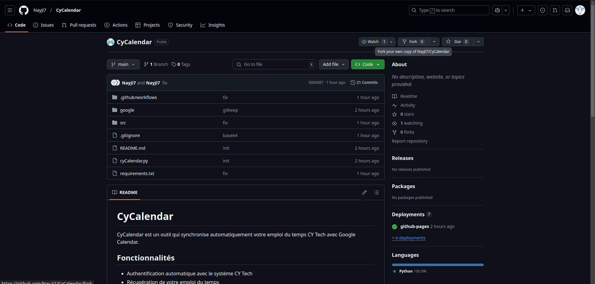

   Changez le nom ou pas faites ce que vous voulez puis validez. Ensuite cliquez sur Actions dans le menu du haut puis un message apparaitra. Cliquez sur le gros bouton vert lol.

   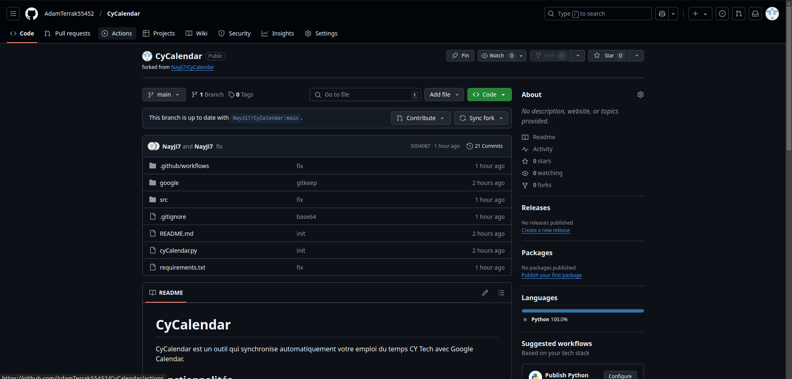

   Une fois ici cliquez sur le workflow Update Google Calendar tout beau tout préconfiguré pour vous waw

   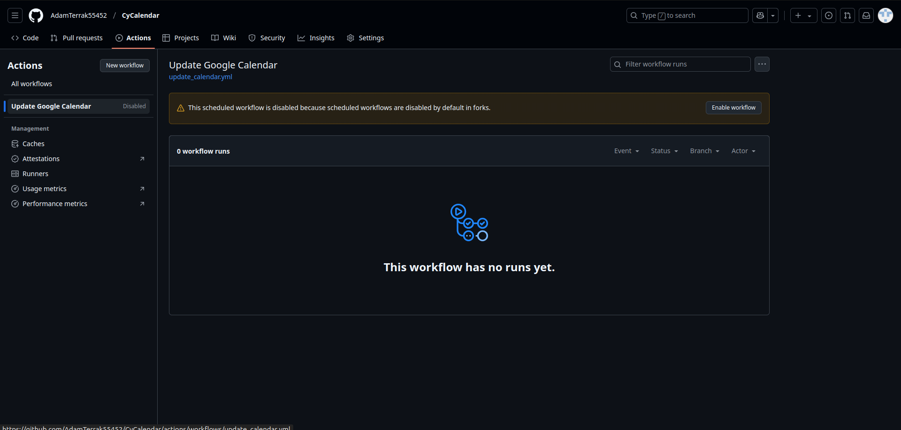

   Puis cliquez sur enable workflow.

   Une fois tout ça fait il va falloir aller créer les variables secrètes d'environnement. Cliquez sur les paramètres de votre nouveau repo puis allez sur Secrets and variable et Actions.

   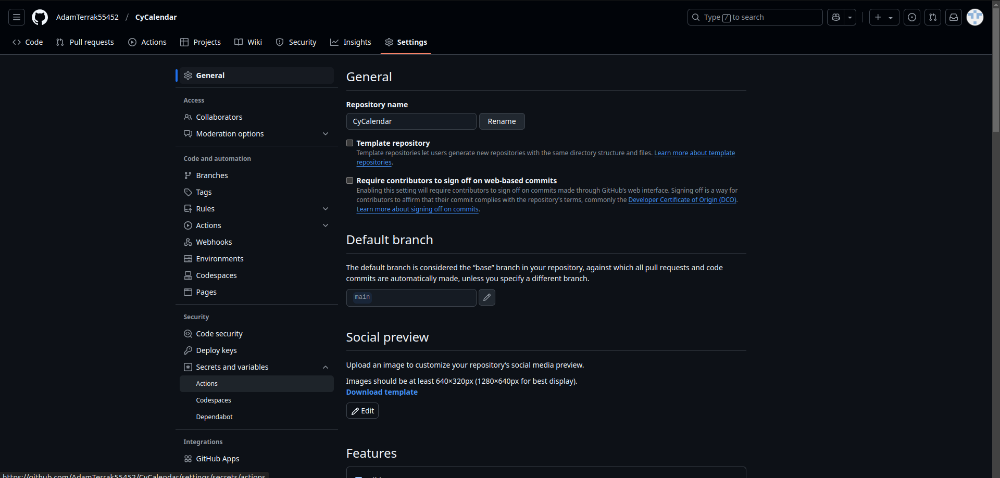

   Une fois sur cette page cliquez sur le gros bouton vert mdr (New repository secret).

   Il va falloir enregistrer 4 variables :

- CY_USERNAME avec la valeur de votre username cy
- CY_PASSWORD avec votre mot de passe associé à cet username
- GOOGLE_CREDENTIALS avec le contenu du fichier google/client_secret ... .json qu'on a généré tout à l'heure
- WORKFLOW_PAT avec un token d'accès personnel GitHub (voir ci-dessous)

  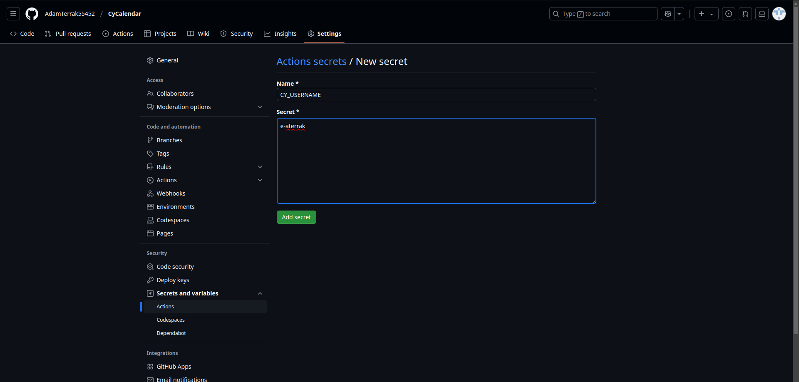

  Il en reste deux mais pour ça il va falloir executer le petit script situé dans src/ en executant la commande : ``python3 src/token_converter.py``
  Vous n'avez plus qu'à copier coller le resultat de votre terminal à une dernière variable qu'il faudra nommer
- GOOGLE_TOKEN_PICKLE avec la valeur précédemment convertie

La dernière variable permet à GitHub Actions de pousser des modifications sur votre dépôt (nécessaire pour la mise à jour automatique de l'horaire 	d'exécution). Vous devez créer un token d'accès personnel (Personal Access Token) :

1. Allez sur votre compte GitHub et cliquez sur votre avatar en haut à droite
2. Sélectionnez **Settings**
3. Descendez et cliquez sur **Developer settings** tout en bas à gauche
4. Sélectionnez **Personal access tokens** puis **Fine-grained tokens**
5. Cliquez sur **Generate new token**
6. Donnez un nom à votre token (ex: "CyCalendar Workflow")
7. Choisissez une durée d'expiration (No expiration ou un an)
8. Dans repository access selectionnez All ou Only select repositories et choisissez votre repo CyCalendar
9. Sélectionnez les permissions suivantes en read/write:
   - `repo` : Actions, Contents, Workflows, Pull Requests,
   - `Account permissions` : rien
10. Cliquez sur **Generate token**
11. **Important**: Copiez le token généré (vous ne pourrez plus le voir après avoir quitté cette page)
12. Ajoutez ce token comme secret dans votre dépôt avec le nom `WORKFLOW_PAT`

   Ce token permettra à l'action GitHub de mettre à jour automatiquement l'horaire d'exécution après chaque succès.

TADAAA. C'est fini. Si vous voulez faire un test manuel vous pouvez retourner sur actions, update google calendar à gauche et cliquer sur run workflow.

   

   Actualisez la page, cliquez sur le workflow qui est apparu, cliquez sur update-calendar puis regardez la magie opérer. Patientez un petit moment (c'est long sur les serveurs ubuntu, ça doit tout réinstaller).

## Structure des dossiers

- `.github/workflows` : Configuration pour le workflow github actions
- `generated/` : Stockage des fichiers ICS générés
- `google/` : Stockage des fichiers d'authentification Google (credentials et token)
- `image/` : Stockage des images utilisées dans le README
- `setup.bash` : Script d'installation pour Linux
- `setup.bat` : Script d'installation pour Windows
- `src/` : Code source du projet

## Résolution de problèmes courants

### Windows

- **Erreur de driver Chrome/Edge** : Assurez-vous d'avoir Chrome ou Microsoft Edge installé sur votre système
- **ImportError: cannot import name 'Display'** : Cette erreur est normale sous Windows, ignorez-la

### Linux

- **Erreur de chromedriver** : Exécutez `sudo apt install chromium-chromedriver` si le script d'installation ne l'a pas fait correctement
- **Affichage virtuel** : Si vous rencontrez des problèmes avec Xvfb, exécutez `sudo apt-get install -y xvfb`

## Suppléments

Eh bien, quelle curiosité, t'as scrollé jusqu'ici quand même. Ici on arrive sur les parametrages un peu plus spéciaux (on va rentrer dans le code source).

- Changement de l'intervalle de récupération des cours
  Année, mois ou semaine

  ```
  calendar_converter.py -> ligne 26
  def get_calendar_data(cookie, student_number,    range='year | month | week'):
  ```

  Récupère les cours de l'année (septembre à date actuelle + 2 mois *ou* janvier à date actuelle + 2 mois), le mois (Du 1 au 31) ou la semaine (lundi à dimanche).
- Changement des couleurs
  Liste des couleurs dispo sous forme de dictionnaire python et de photos (src/google_colors.py et google/google_..._colors.png)

  Couleur de l'agenda Cours CY

  ```
   google_calendar.py -> ligne 102

        calendar_list_entry['colorId'] = calendar_colors['Cobalt | autre couleur de la liste des calendar colors']
  ```

  Couleur des cours (evenements)

  ```
   google_calendar.py -> ligne 138

   if any(term in summary.lower() for term in ['examen', 'rattrapages']):
        return event_colors['Sage'] # Vert
    elif 'CM' in summary:
        return event_colors['Peacock'] # Bleu
    elif 'TD' in summary:
        return event_colors['Tomato'] # Rouge
    elif 'TP' in summary:
        return event_colors['Tangerine'] # Orange
    return event_colors['Graphite']  # Couleur par défaut
  ```

## Auteur et informations

- Projet créé par Adam Terrak pour les étudiants de CyTech - ([@NayJi7](https://github.com/NayJi7))
- Contact discord: [@nay.ji](https://discord.com/users/431329520197304320)
